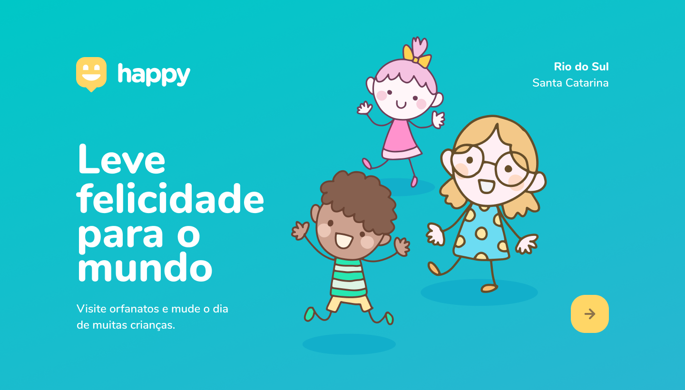

<h1 align="center">
    
</h1>

  

## 💻 Projeto

Projeto desenvolvido durante a **[Next Level Week](https://nextlevelweek.com/)**, realizada pela **[@Rocketseat](https://github.com/Rocketseat)**!! :rocket::rocket:
Tem o objetivo de facilitar a visitação e o conhecimento sobre os lares adotivos de crianças.

  

## 🚀 Tecnologias

 >>[Node.js](https://nodejs.org/en/)   >>[React](https://reactjs.org) >>[React Native](https://facebook.github.io/react-native/) >>[SQLite](https://www.sqlite.org/index.html)  >>[Typescript](https://www.typescriptlang.org/)

## 📝 Licença 

Esse projeto está sob a licença MIT. Veja o arquivo [LICENSE](LICENSE.md) para mais detalhes.

---

